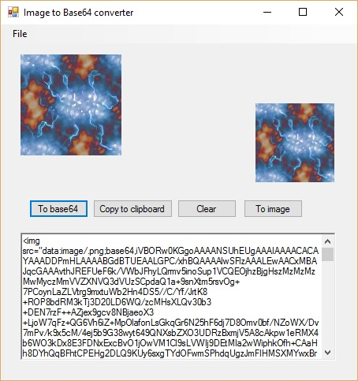

# Image-to-Base64_-_Base64-to-Image-Converter
This simple tool is written in C# and quickly allows you to convert images by drag & drop or pasting a string into the 
textbox & converting it back to an image.

Convert a typical Image File (png, jpg etc) into a Base64 string and vice versa.

